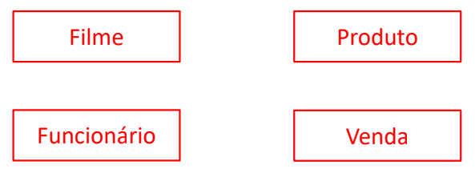
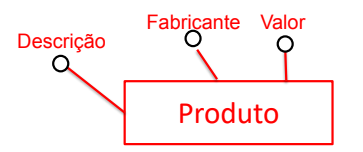
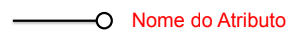
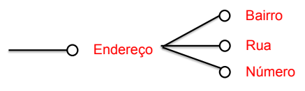
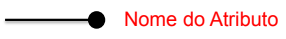
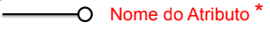
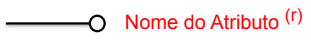
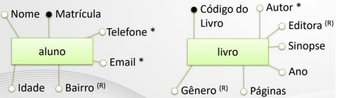
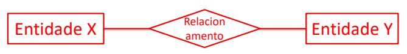

# Modelo conceitual

## 💡 Conceitos Básicos 💡

### ⚜ Modelo Entidade Relacionamento (MER):

- É uma forma de descrever e definir um processo de negócio.
- Esse processo é definido utilizando componentes: Entidades, relacionamentos entre elas e algumas propriedades (atributos).
- Esse modelo foi criado por um cientista da computação chamado Peter Chen.

### 📈 Diagrama Entidade-Relacionamento (DER):

- Representação gráfica de Entidades, Relacionamentos e Atributos.

### 📝 Entidade:

- É algo do mundo real que tenha importância para um usuário ou organização, e que precise ser
representado no banco de dados;
- A entidade pode ter existência física ou abstrata, representando um tema ou conceito de negócio;
- Cada objeto de um entidade é chamado de instância de entidade. EX: Filme, Produto, Funcionário, Venda.
- **A representação gráfica de uma entidade** em um DER é feita utilizando um retângulo contendo o nome da mesma.

### ⚙ Regras de nomeação de entidades:

- Começar com letra;
- Palavras no singular;
- Não podem ter espaços em branco;
- São permitidos alguns caracteres especiais, depende do banco utilizado;
- Dentro de uma base de dados o nome da entidade deve ser único.

### 📲 Atributos:

- São características (propriedades) utilizadas para descrever uma entidade;
- São específicos de cada entidade. EX: A entidade PRODUTO tem os seguintes
atributos: Descrição, Fabricante, Quantidade, Valor.
- **A representação gráfica de um atributo** em um DER é feita utilizando uma elipse (contendo o nome do mesmo), ligada a uma entidade. OBS: Opcionalmente, pode ser representado só com o nome.

### 📍 Tipos de atributos:

- **Simples:** serve para armazenar uma informação básica (ex.: nome, data de nascimento) Indivisível.

- **Composto:** é um atributo que pode ser dividido, formado por itens menores. Divisível

- **Determinante:** tem um valor que nunca se repete dentre os registros. Quando não há um natural (ex.: CPF, RG), podemos criar um atributo artificial (ex.: código)

- **Multivalorado:** é aquele que pode receber mais de um dado (ex.: uma pessoa pode ter um, dois ou vários telefones, e-mail; um filme pode ter mais de um ator)

- **Redundância funcional:** é aquele que possui um valor que pode se repetir excessivamente no banco (ex.: categoria, gênero de um filme)

### ⚙ Regras dos atributos:

- Atributos de valores numéricos e de datas nunca entram em redundância funcional (ex.: ano,idade).
- Atributos cujo o valor é sempre “sim” ou “não”, não necessitam entrar em redundância funcional.
- Se houver redundância funcional e multivaloração ao mesmo tempo, marcamos apenas multivaloração.

### ✍🏻 Exemplo prático de entidades e atributos: Biblioteca

### 🔗 Relacionamento

- Estrutura que possibilita uma ligação entre elementos de uma ou mais entidades.
- São utilizados para juntar dados de entidades diferentes e assim, dentre outras coisas, possibilitar respostas a diversas perguntas. EX: Quantas compras foram realizadas por um
determinado cliente? Qual o montante vendido por um determinado vendedor?
- **A representação gráfica de um relacionamento** em um DER é feita utilizando um losango (contendo o nome do mesmo), ligada a uma ou mais entidade.

